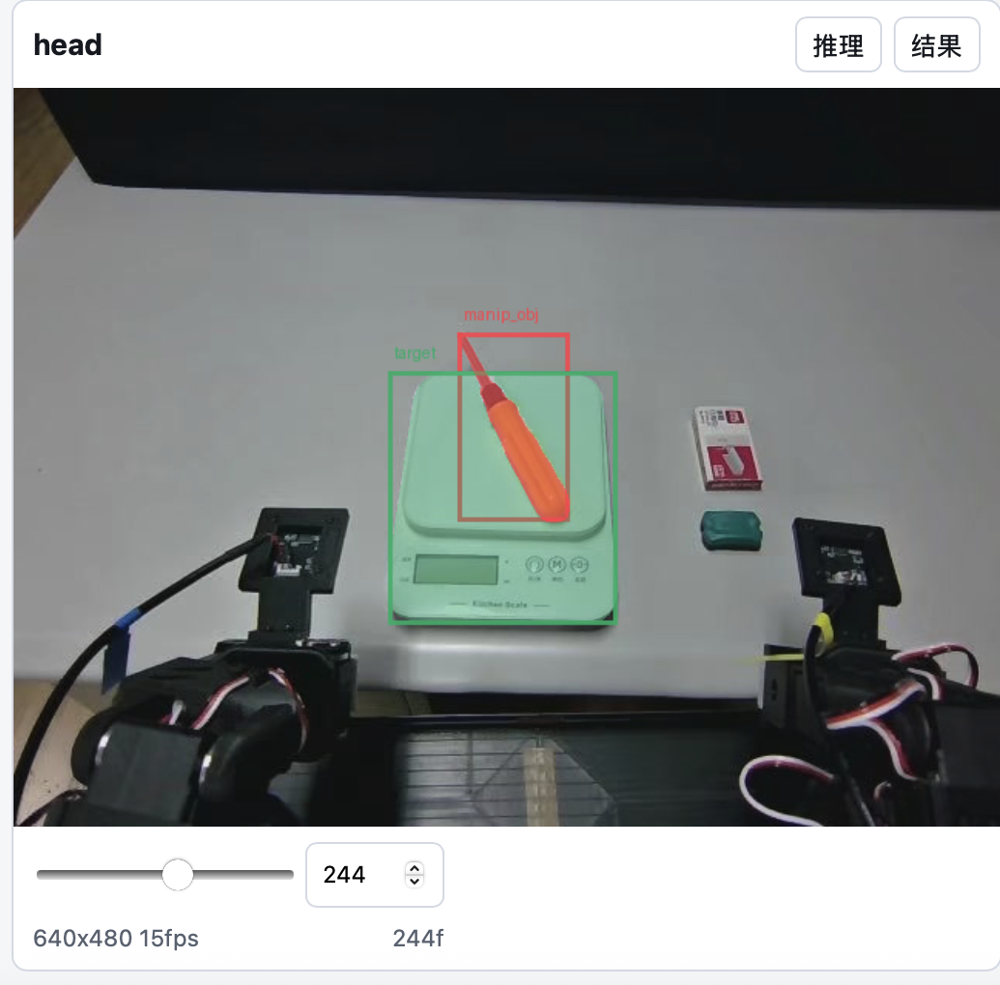
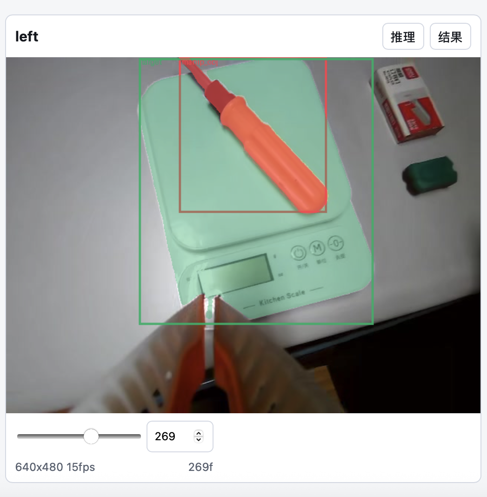

# VLA Video Annotation Tool

Browser-based multi-view video segmentation annotation for VLA and robot datasets. It is designed for three synchronized camera views (`head`, `left`, `right`) and writes NumPy masks, boxes, prompt metadata, overlays, and manual edit logs.

Default backend: **SAM2.1** for point and box prompts. **SAM3.1** is optional for text-prompt workflows.

[中文 README](README.zh-CN.md)

## Screenshots





## Features

- Web UI with Chinese and English language switcher. Chinese is the default.
- Three-view video browsing and frame-accurate prompt placement.
- Point, box, text prompt, brush, and eraser tools.
- Background episode queue with optional multi-GPU view parallelism.
- Result preview, overlay rendering, and manual mask correction.
- Local-only server built on Python standard-library HTTP APIs.

## Data Layout

The tool expects this layout by default:

```text
<dataset-root>/
  videos/
    chunk-000/
      observation.images.ros_head/episode_000000.mp4
      observation.images.ros_left/episode_000000.mp4
      observation.images.ros_right/episode_000000.mp4
```

You can pass either `<dataset-root>` with a `videos/` subdirectory or pass the `videos/` directory directly.

## Installation

Requirements:

- Python 3.10+
- `ffmpeg` and `ffprobe` on `PATH`
- CUDA-capable PyTorch for SAM inference
- SAM2.1 installed so `from sam2.build_sam import build_sam2_video_predictor` works

```bash
git clone <repo-url>
cd VLA-video-data-annotation-tool

python -m venv .venv
source .venv/bin/activate
python -m pip install -U pip
python -m pip install -e .
```

Install PyTorch using the command that matches your CUDA version, then install Meta SAM/SAM2 according to the official instructions for your environment.

Put model weights in `checkpoints/` or provide explicit paths at startup:

```text
checkpoints/sam2.1_hiera_base_plus.pt
checkpoints/sam3.1_multiplex.pt     # optional
```

## Start

SAM2.1 point/box workflow:

```bash
vla-video-annotator \
  --dataset-root /path/to/dataset \
  --output-root /path/to/annotation_outputs \
  --model-backend sam21 \
  --checkpoint /path/to/sam2.1_hiera_base_plus.pt \
  --host 127.0.0.1 \
  --port 7861
```

Open `http://127.0.0.1:7861`.

Optional SAM3.1 text workflow:

```bash
vla-video-annotator \
  --dataset-root /path/to/dataset \
  --output-root /path/to/annotation_outputs \
  --model-backend sam31 \
  --checkpoint /path/to/sam3.1_multiplex.pt
```

## Startup Options

| Option | Default | Description |
| --- | --- | --- |
| `--dataset-root` | unset | Dataset root. If it contains `videos/`, that subdirectory is used. |
| `--video-root` | `data/videos` | Direct path to the `videos/` directory. |
| `--output-root`, `--result-root` | `outputs/annotations` | Annotation result directory. |
| `--cache-root` | `/tmp/vla_video_annotator` | Extracted frame cache. |
| `--model-backend` | `sam21` | `sam21` or `sam31`. |
| `--checkpoint` | backend default under `checkpoints/` | Model checkpoint path. |
| `--sam21-config` | `configs/sam2.1/sam2.1_hiera_b+.yaml` | SAM2.1 config name/path. |
| `--bpe-path` | unset | Optional SAM3.1 BPE/tokenizer file path. |
| `--gpu-id` | unset | CUDA GPU ID. Empty means current CUDA default. |
| `--inference-dtype` | `bfloat16` | `float32` or `bfloat16`. |
| `--async-loading-frames` | false | Enable backend async frame loading when supported. |
| `--frame-extract-threads` | `8` | FFmpeg extraction thread count. |
| `--preload-model` | false | Load the model at server startup. |
| `--host` | `127.0.0.1` | HTTP bind host. |
| `--port` | `7861` | HTTP port. |

Equivalent environment variables for common defaults:

```bash
export VLA_ANNOTATOR_VIDEO_ROOT=/path/to/dataset/videos
export VLA_ANNOTATOR_OUTPUT_ROOT=/path/to/annotation_outputs
export SAM21_CHECKPOINT=/path/to/sam2.1_hiera_base_plus.pt
export SAM31_CHECKPOINT=/path/to/sam3.1_multiplex.pt
export SAM21_CONFIG=configs/sam2.1/sam2.1_hiera_b+.yaml
```

## Usage

1. Start the server and open the web page.
2. Select the interface language in the sidebar. Chinese is selected by default.
3. Set dataset location, output directory, GPU, backend, and checkpoint if needed.
4. Select an episode.
5. Move each view slider to the frame where the target first appears.
6. Choose labels. The defaults are `manip_obj` and `target`.
7. Use point or box prompts for SAM2.1. Use text prompts with SAM3.1 if needed.
8. Click **Preview start frame** to validate prompts.
9. Click **Add to queue** or **Submit all views** to run propagation.
10. Use brush/eraser on the result view and click **Save manual edits** when needed.

## Output

```text
outputs/annotations/<episode>/<view>/
  mask_int.npy       # uint16 [T, H, W], 0 background, 1..N label IDs
  boxes_xywh.npy     # float32 [T, N, 4], x/y/w/h, NaN for empty frames
  object_masks.npz   # bool masks per label, [T, H, W]
  metadata.json      # labels, video info, stats, output file index
  prompts.json       # text, point, and box prompts
  overlays/*.png     # rendered result overlays
  manual_edits.jsonl # manual edit records
```

## Privacy Notes

This repository intentionally does not include datasets, model weights, generated annotations, local cache files, or private absolute paths. Keep real data paths in command-line arguments, environment variables, or local-only config.

## License

This project is released under the Apache License 2.0. Meta SAM model code and weights are separate dependencies and remain governed by their own licenses and terms.
