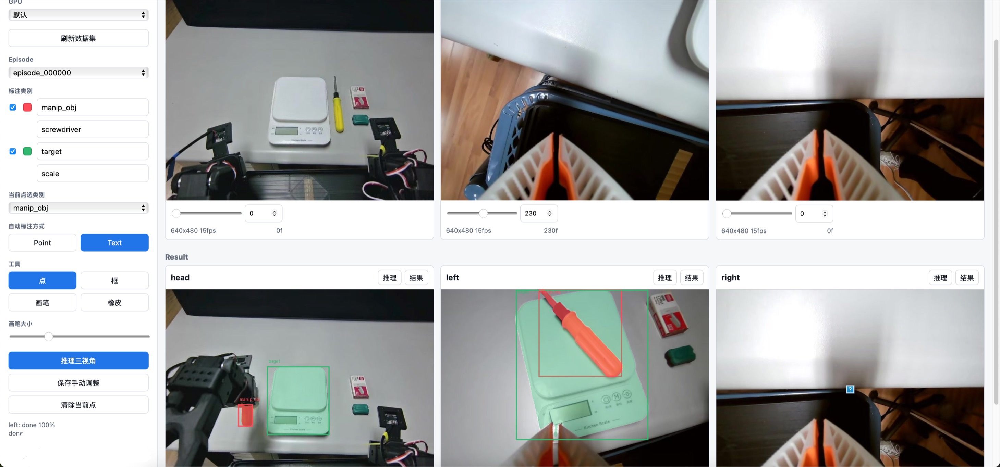

# VLA Video Annotation Tool

[](LICENSE)
[](NOTICE)
[](README.md)

面向 VLA/机器人数据的网页式多视角视频分割标注工具。

本项目 **based heavily on Meta Segment Anything workflows**。它提供围绕 SAM 系列视频分割后端的标注界面与本地服务，但不内置 SAM 代码、模型权重、数据集或生成的标注结果。

默认流程：**SAM2.1 + 点/框 prompt**。

可选流程：**SAM3.1 + 文本 prompt**。

English documentation: [README.md](README.md)



## 能做什么

| 模块 | 支持能力 |
| --- | --- |
| 视角 | 三个同步相机视角：`head`、`left`、`right` |
| Prompt | 点、框、文本 prompt |
| 手动修正 | 画笔、橡皮、逐帧结果修正 |
| 队列 | Episode 后台队列，可选多 GPU 并行处理多个视角 |
| 输出 | NumPy mask、bbox、object mask、prompt 元数据、overlay |
| 界面语言 | 默认中文，网页内可切换英文 |

## 安装

本工具默认你已经有可用的 Meta SAM 环境。请先直接遵从官方 **SAM3 安装流程** 搭好 Python/CUDA 环境：

- SAM3 官方仓库：<https://github.com/facebookresearch/sam3>
- SAM2 官方仓库，默认 `sam21` 后端需要：<https://github.com/facebookresearch/sam2>

确认 SAM 环境可用后，在同一个环境中安装本标注工具：

```bash
git clone https://github.com/Rorschach2333/VLA-video-data-annotation-tool.git
cd VLA-video-data-annotation-tool
python -m pip install -e .
```

Python 之外还需要：

- `ffmpeg`
- `ffprobe`
- SAM 环境支持的 CUDA GPU

模型权重不包含在仓库中。建议放在本地 `checkpoints/` 或启动时显式传入：

```text
checkpoints/
  sam2.1_hiera_base_plus.pt
  sam3.1_multiplex.pt        # 可选
```

## 快速启动

SAM2.1 点/框标注：

```bash
vla-video-annotator \
  --dataset-root /path/to/dataset \
  --output-root /path/to/annotation_outputs \
  --model-backend sam21 \
  --checkpoint /path/to/sam2.1_hiera_base_plus.pt \
  --host 127.0.0.1 \
  --port 7861
```

浏览器打开：

```text
http://127.0.0.1:7861
```

可选 SAM3.1 文本 prompt 标注：

```bash
vla-video-annotator \
  --dataset-root /path/to/dataset \
  --output-root /path/to/annotation_outputs \
  --model-backend sam31 \
  --checkpoint /path/to/sam3.1_multiplex.pt
```

## 数据目录

启动参数可以传数据集根目录，也可以直接传 `videos/` 目录。

```text
<dataset-root>/
  videos/
    chunk-000/
      observation.images.ros_head/
        episode_000000.mp4
      observation.images.ros_left/
        episode_000000.mp4
      observation.images.ros_right/
        episode_000000.mp4
```

## 使用流程

1. 启动服务并打开网页。
2. 在左侧选择界面语言，默认中文。
3. 设置数据集路径、输出路径、GPU、后端和 checkpoint。
4. 选择 episode。
5. 分别拖动三个视角，到目标需要开始跟踪的第一帧。
6. 保留或修改默认类别：`manip_obj`、`target`。
7. SAM2.1 使用点/框 prompt；如需文本 prompt，切换到 SAM3.1。
8. 先预览起始帧。
9. 将 episode 加入队列，或直接提交三视角任务。
10. 在结果区用画笔/橡皮修正 mask，并保存手动调整。

## 输出格式

```text
outputs/annotations/<episode>/<view>/
  mask_int.npy
  boxes_xywh.npy
  object_masks.npz
  metadata.json
  prompts.json
  overlays/*.png
  manual_edits.jsonl
```

| 文件 | 含义 |
| --- | --- |
| `mask_int.npy` | `uint16 [T, H, W]`，`0` 为背景，`1..N` 为类别 ID |
| `boxes_xywh.npy` | `float32 [T, N, 4]`，`x/y/w/h`，空帧为 `NaN` |
| `object_masks.npz` | 每个类别一个 bool mask |
| `metadata.json` | 视频信息、类别、统计信息、输出文件索引 |
| `prompts.json` | 文本、点、框 prompt |
| `overlays/*.png` | 渲染后的预览/结果 overlay |
| `manual_edits.jsonl` | 手动修正记录 |

## 服务参数

| 参数 | 默认值 | 说明 |
| --- | --- | --- |
| `--dataset-root` | 未设置 | 数据集根目录。如果包含 `videos/`，自动使用该子目录。 |
| `--video-root` | `data/videos` | 直接指定 `videos/` 目录。 |
| `--output-root`, `--result-root` | `outputs/annotations` | 标注输出目录。 |
| `--cache-root` | `/tmp/vla_video_annotator` | 抽帧缓存目录。 |
| `--model-backend` | `sam21` | `sam21` 或 `sam31`。 |
| `--checkpoint` | `checkpoints/` 下的后端默认文件 | 模型 checkpoint 路径。 |
| `--sam21-config` | `configs/sam2.1/sam2.1_hiera_b+.yaml` | SAM2.1 配置名或配置路径。 |
| `--bpe-path` | 未设置 | 可选 SAM3.1 tokenizer/BPE 路径。 |
| `--gpu-id` | 未设置 | CUDA GPU ID。为空时使用进程默认设备。 |
| `--inference-dtype` | `bfloat16` | `float32` 或 `bfloat16`。 |
| `--async-loading-frames` | false | 后端支持时启用异步加载帧。 |
| `--frame-extract-threads` | `8` | FFmpeg 抽帧线程数。 |
| `--preload-model` | false | 服务启动时加载模型。 |
| `--host` | `127.0.0.1` | HTTP 绑定地址。 |
| `--port` | `7861` | HTTP 端口。 |

常用环境变量：

```bash
export VLA_ANNOTATOR_VIDEO_ROOT=/path/to/dataset/videos
export VLA_ANNOTATOR_OUTPUT_ROOT=/path/to/annotation_outputs
export SAM21_CHECKPOINT=/path/to/sam2.1_hiera_base_plus.pt
export SAM31_CHECKPOINT=/path/to/sam3.1_multiplex.pt
export SAM21_CONFIG=configs/sam2.1/sam2.1_hiera_b+.yaml
```

## 隐私

仓库刻意排除了数据集、模型权重、生成标注文件、抽帧缓存和私人绝对路径。真实路径请放在命令行参数、环境变量或本地脚本中。

## 协议与归属

本仓库中的原创标注工具代码使用 [Apache License 2.0](LICENSE)。

本项目 heavily based on Meta Segment Anything 的概念、API 与模型工作流。Meta SAM 系列代码、checkpoint、权重和相关资源是独立依赖，继续遵守其各自许可证与使用条款。详见 [NOTICE](NOTICE)。
